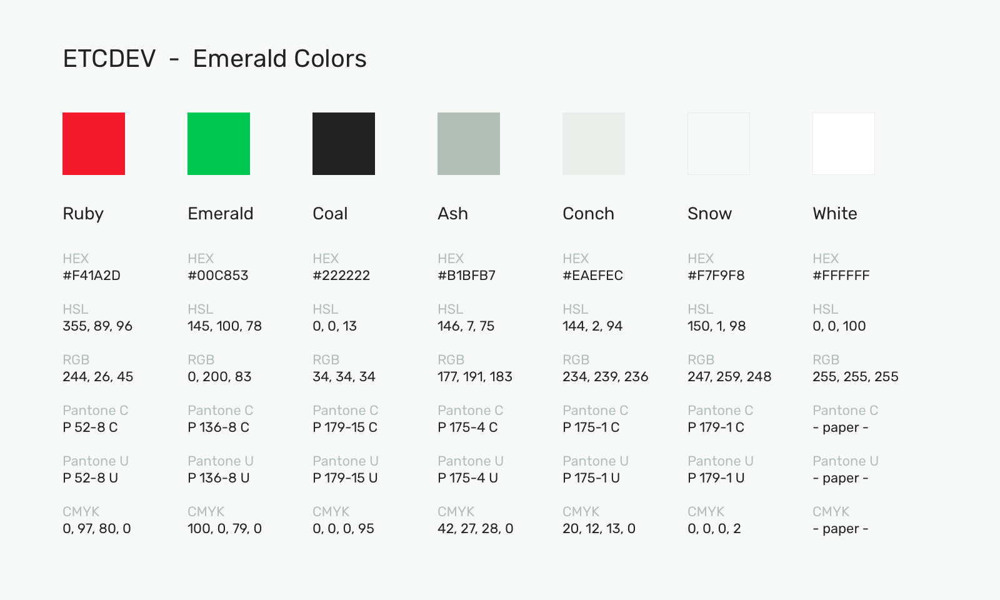

# Emerald Styleguide

## Colors

    //EMERALD COLORS

    $ruby = 	"#F41A2D";
    $emerald = 	"#00C853";
    $coal = 	"#222222";
    $ash =		"#B1BFB7";
    $conch = 	"#EAEFEC";
    $snow = 	"#F7F9F8";
    $white = 	"#FFFFFF";

    $ruby_rgb =		rgb(244,26,45);
    $emerald_rgb =	rgb(0,200,83);
    $coal_rgb =		rgb(34,34,34);
    $ash_rgb =		rgb(177,191,183);
    $conch_rgb =	rgb(234,239,236);
    $snow_rgb =		rgb(247,259,248);
    $white_rgb =	rgb(255,255,255);

